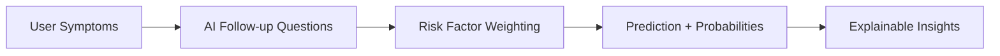
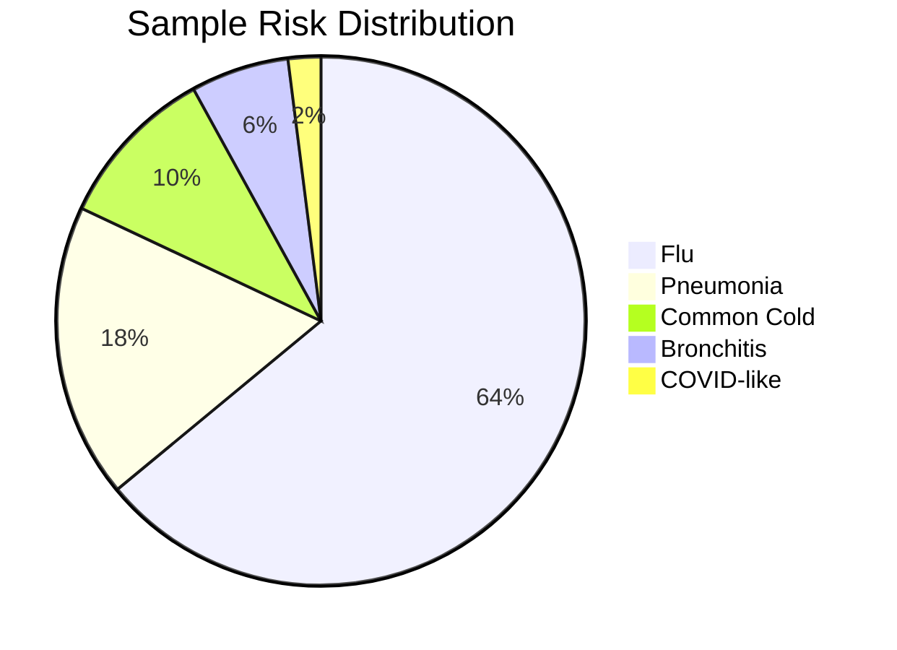

# SymptoScan — Early Health Risk Detection

AI-powered symptom analysis that predicts possible diseases early and helps users understand potential health risks before serious illness occurs.

Built for a MedTech Hackathon by CTRL-C & CTRL-V.


# **Main website (public):**  https://early-risk-detection-for-health.onrender.com/
-----------------------------------------------------------------------
# **Demo video:**  https://drive.google.com/file/d/1l1KDMydGJV2-N1hdOQ8Dr-Cd_d7rmSgA/view?usp=sharing
-------------------------------------------------------------------------------------

## Table of Contents

- Overview
- Key Features
- System Architecture
- Project Structure
- Model Details
- Quick Start
- Security
- Screenshots
- Visual Insights
- Contributors
- License & Copyright

## Overview

Many serious illnesses begin with mild symptoms that people often ignore. SymptoScan is a decision-support assistant that:

- analyzes symptoms
- predicts possible diseases
- asks targeted follow-up questions
- provides risk insights

Disclaimer: This system is not a medical diagnosis tool.

## Key Features

- AI symptom analysis with probabilistic outputs
- Dynamic follow-up questions that reduce long questionnaires
- Symptom relationship modeling via embeddings and graphs
- Explainable predictions with contributing symptoms
- Risk-factor weighting and disease priors for realistic context

## System Architecture

```
Frontend (React)
    |
    v
Backend API (FastAPI)
    |
    v
AI Prediction Engine (PyTorch)
    |
    v
SQLite Database
```

## Project Structure

```
project-root
|-- frontend
|-- backend
|-- ai-model
|   |-- train.py
|   |-- model.py
|   |-- inference.py
|   |-- symptom_graph.py
|   |-- build_embeddings.py
|   |-- disease_model.pt
|   |-- symptom_index.json
|   `-- disease_labels.json
|-- datasets
|-- docs
|-- image
|-- README.md
```

## Model Details

Model inputs:

- 377 symptom features
- symptom embeddings

Model output:

- ~400 diseases

Training techniques:

- class balancing
- feature embeddings
- batch normalization
- dropout
- train/test split

Reported performance:

- Top-1 Accuracy: ~84-85%
- Top-5 Accuracy: ~97%

## Quick Start

### Backend

```bash
cd backend
python -m venv .venv
. .venv/Scripts/activate
pip install -r requirements.txt
uvicorn main:app --reload
```

### Frontend

```bash
cd frontend
npm install
npm run dev
```

### Dataset Cache (optional)

```bash
python -c "from dataset_cache import load_cached_dataset; load_cached_dataset()"
```

### Model Artifacts (Render / no model in git)

If the model files are not in git, download them before starting the backend:

```bash
python backend/download_models.py
```

The script reads `MODEL_PATH` to decide where to place `disease_model.pt` and uses `DATA_CACHE_DIR` for `X.npy`, `y.npy`, and `symptom_names.npy`.
Defaults:

- `MODEL_PATH=../ai-model/disease_model.pt`
- `DATA_CACHE_DIR=backend`

## Security

- JWT authentication
- Role-Based Access Control (RBAC)
- Secure API endpoints
- User and Admin dashboards

## Screenshots

All images are sourced from the root image/ folder.


## Visual Insights

### Model Accuracy Snapshot

```text
Top-1 Accuracy  | ###########################  85%
Top-5 Accuracy  | #####################################  97%
```

### Symptom Flow (Mermaid)



### Probability Distribution (Mermaid)



## Contributors

Team CTRL-C & CTRL-V

- Hitesh Kumar Roy (Team Leader)
- Tamoghno Das
- Debadrita Chowdhury

## License & Copyright

Copyright (c) 2026 CTRL-C & CTRL-V. All rights reserved.

This project is intended for educational and early awareness purposes only. It does not replace professional medical advice.
